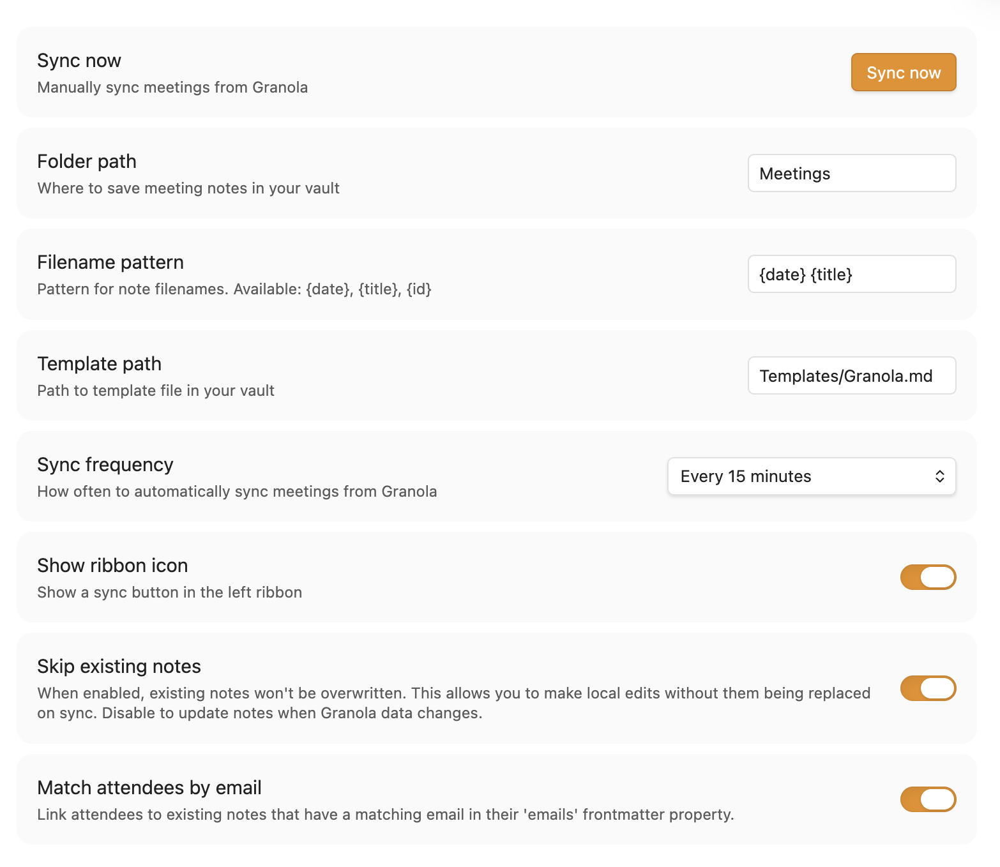

# Obsidian Plugin: Granola Meetings Simple Sync

Sync your [Granola](https://granola.ai) meeting notes to Obsidian.

This plugin reads directly from Granola's local cache file—no API calls or authentication needed.

## Features

- **Auto-sync**: Automatically sync meetings at configurable intervals (1m to 12h)
- **Template-based**: Customize output format with your own template
- **Local-first**: Reads from Granola's local cache, no network requests
- **Smart deduplication**: Tracks meetings by ID to avoid duplicates
- **Preserve edits**: Option to skip existing notes so your local changes aren't overwritten
- **Attendee linking**: Automatically link attendees to existing notes by email

There are other ([1](https://github.com/dannymcc/Granola-to-Obsidian), [2](https://github.com/tomelliot/obsidian-granola-sync)) Granola plugins for Obsidian, but I found their implementation lacking for my needs. They either had unnecessary complexity or didn't support features like bringing in private notes, linking to attendee Person notes, or customizing the note template/frontmatter. This plugin fits my workflow better.

## Installation

### From Obsidian Community Plugins (Recommended)
1. Open Settings → Community plugins
2. Search for "Granola Meetings Simple Sync
3. Click Install, then Enable

### Manual Installation
1. Download the zip from the [latest release](https://github.com/philfreo/obsidian-granola-simple-plugin/releases)
2. Extract to `<vault>/.obsidian/plugins/`
3. Enable the plugin in Settings → Community plugins

## Settings



| Setting | Default | Description |
|---------|---------|-------------|
| Folder path | `Meetings` | Where to save meeting notes |
| Filename pattern | `{date} {title}` | Pattern for filenames. Supports `{date}`, `{title}`, `{id}` |
| Template path | `Templates/Granola.md` | Path to your template file |
| Sync frequency | Every 15 minutes | How often to sync. Options: Manual only, On startup, 1m, 15m, 30m, 60m, 12h |
| Show ribbon icon | On | Show a sync button in the left sidebar |
| Skip existing notes | On | Don't overwrite notes you've edited |
| Match attendees by email | On | Link attendees to notes with matching email in frontmatter |

## Usage

1. **Sync meetings**: By default your meetings will be synced every 15 minutes. This setting is customizable, and you can also trigger a sync by clicking the ribbon icon, using the command palette ("Granola Meetings Simple Sync: Sync meetings"), click "Sync now" in settings. Or, do nothing and allow automatic sync to work.

## Template Variables

Create a template file to customize how your meeting notes look. Use these variables:

### Core
- `{{granola_id}}` - Unique meeting ID
- `{{granola_title}}` - Meeting title
- `{{granola_date}}` - Date (YYYY-MM-DD)
- `{{granola_created}}` - Created timestamp (ISO)
- `{{granola_updated}}` - Updated timestamp (ISO)
- `{{granola_url}}` - Link to meeting on Granola web

### Content
- `{{granola_private_notes}}` - Your notes from the meeting
- `{{granola_enhanced_notes}}` - AI-generated content (Summary, Action Items, etc.)
- `{{granola_transcript}}` - Full transcript formatted by speaker

### Attendees
- `{{granola_attendees}}` - Comma-separated names
- `{{granola_attendees_linked}}` - With Obsidian links: `[[John]], [[Jane]]`
- `{{granola_attendees_list}}` - YAML list format
- `{{granola_attendees_linked_list}}` - YAML list with links

### Time
- `{{granola_start_time}}` - Start time (e.g., "10:30 AM")
- `{{granola_end_time}}` - End time
- `{{granola_duration}}` - Duration (e.g., "45 min")

### Default Template

If no template exists, the plugin creates this default:

```markdown
---
granola_id: {{granola_id}}
granola_url: {{granola_url}}
title: "{{granola_title}}"
date: {{granola_date}}
created: {{granola_created}}
updated: {{granola_updated}}
attendees:
{{granola_attendees_linked_list}}
tags:
  - meeting
  - granola
---
{{#granola_private_notes}}## Notes

{{granola_private_notes}}
{{/granola_private_notes}}
{{granola_enhanced_notes}}
{{#granola_transcript}}

## Transcript

{{granola_transcript}}
{{/granola_transcript}}
```

## Requirements

- **Desktop only**: This plugin uses Node.js file system access
- **Granola installed**: The plugin reads from Granola's local cache file

## Development

```bash
# Install dependencies
npm install

# Build (watch mode)
npm run dev

# Build (for production)
npm run build

# Package for release
npm run package
```

### Releasing

Per [Obsidian's guidelines](https://github.com/obsidianmd/obsidian-sample-plugin), tags should **not** use a `v` prefix (use `1.0.0`, not `v1.0.0`).

## License

MIT
